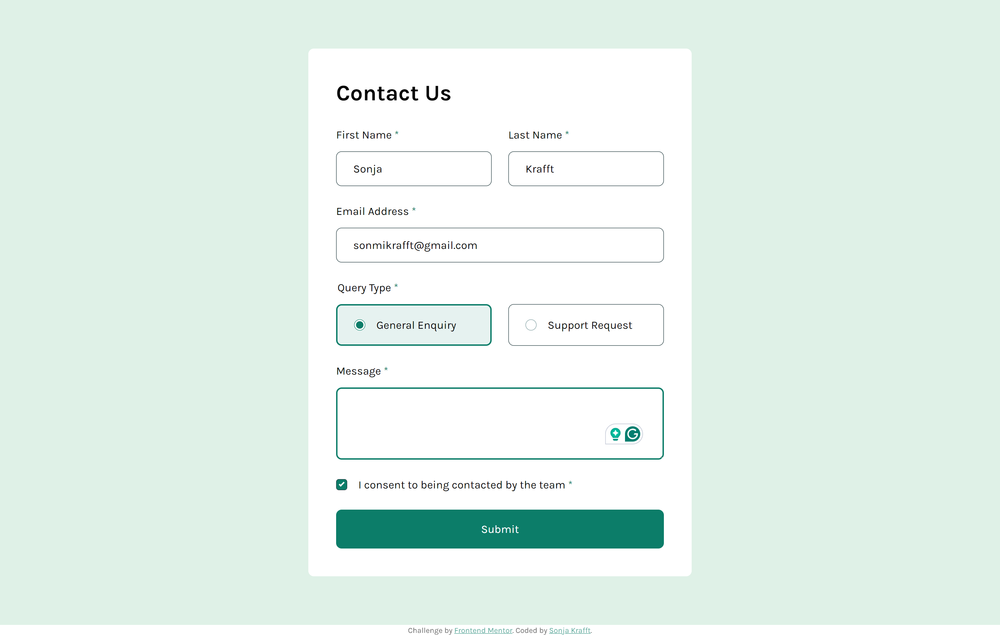
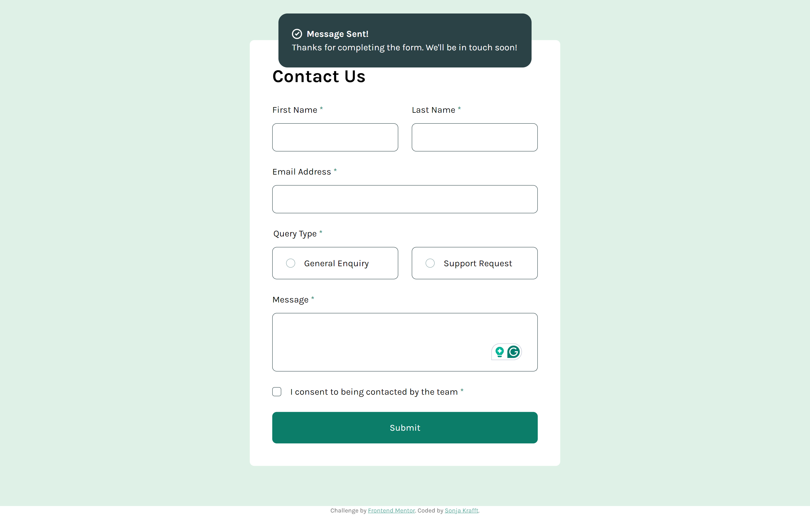
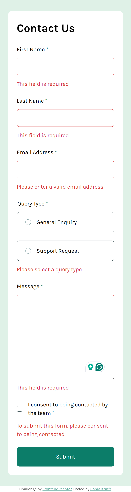

# Frontend Mentor - Contact form solution

This is a solution to the [Contact form challenge on Frontend Mentor](https://www.frontendmentor.io/challenges/contact-form--G-hYlqKJj). Frontend Mentor challenges help you improve your coding skills by building realistic projects. 

## Table of contents

- [Overview](#overview)
  - [The challenge](#the-challenge)
  - [Screenshot](#screenshot)
  - [Links](#links)
- [My process](#my-process)
  - [Built with](#built-with)
  - [What I learned](#what-i-learned)
  - [Continued development](#continued-development)
  - [Useful resources](#useful-resources)
- [Author](#author)


## Overview

### The challenge

Users should be able to:

- Complete the form and see a success toast message upon successful submission
- Receive form validation messages if:
  - A required field has been missed
  - The email address is not formatted correctly
- Complete the form only using their keyboard
- Have inputs, error messages, and the success message announced on their screen reader
- View the optimal layout for the interface depending on their device's screen size
- See hover and focus states for all interactive elements on the page

### Screenshot





### Links

- Live Site URL: [Add live site URL here](https://your-live-site-url.com)

## My process

### Built with

- HTML, SCSS, JS
- Mobile-first workflow
- Webstorm with Simple Hot Reload Server (install: `npm install -g simple-hot-reload-server`, start: `hrs`) and File Watcher with SCSS for building CSS

### What I learned

Use this section to recap over some of your major learnings while working through this project. Writing these out and providing code samples of areas you want to highlight is a great way to reinforce your own knowledge.

To see how you can add code snippets, see below:

- Custom Checkboxes and Radio Buttons
- Snackbar
- Attribute Selector matches all matching classes
```css
[class*="error"]  {
  color: $red;
}
```
- change parent when child is checked
```css
.option:has(input[type=radio]:checked) {
  border: 2px solid $medium_green;
  background-color: rgba($medium_green, 0.1);
}
```
- Timeout
```js
setTimeout(() => {
  snackbar.classList.remove("snackbar_show");
}, 3000);
```

### Continued development

The viewport sizes still kill me.

### Useful resources

- [Basic native form controls](https://developer.mozilla.org/en-US/docs/Learn/Forms/Basic_native_form_controls)
- [Labeling Controls](https://www.w3.org/WAI/tutorials/forms/labels/)
- [Grouping Controls](https://www.w3.org/WAI/tutorials/forms/grouping/)
- [Form Instructions](https://www.w3.org/WAI/tutorials/forms/instructions/)
- [HTML attribute: autocomplete](https://developer.mozilla.org/en-US/docs/Web/HTML/Attributes/autocomplete)
- [Accessibility Keyboard](https://design.homeoffice.gov.uk/accessibility/forms/keyboard)
- [Validating Input](https://www.w3.org/WAI/tutorials/forms/validation/)
- [Indicating form controls as required using asterisks (*)](https://www.accessibility-developer-guide.com/examples/forms/required/)
- [The Anatomy of Accessible Forms: Required Form Fields](https://www.deque.com/blog/anatomy-of-accessible-forms-required-form-fields/)
- [Inclusive Inputs](https://www.ovl.design/text/inclusive-inputs/)

Accessibility Tools:
- [Axe® accessibility testing tools are the best on the planet](https://www.deque.com/axe/)
- [Lighthouse](https://developer.chrome.com/docs/lighthouse/overview?hl=de)
- [Solve accessibility issues before they reach your customers.](https://accessibilityinsights.io/)

Tutorials for Forms:
- [Learn Forms](https://web.dev/learn/forms)
- [Forms Tutorial](https://www.w3.org/WAI/tutorials/forms/)
- [Forms](https://www.accessibility-developer-guide.com/examples/forms/)

## Author


- Github - [Sonja Krafft](https://www.github.com/sonmikrafft)
- Frontend Mentor - [@sonmikrafft](https://www.frontendmentor.io/profile/sonmikrafft)